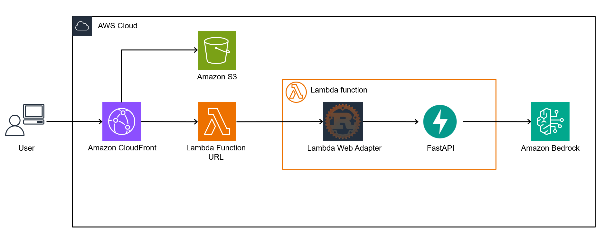
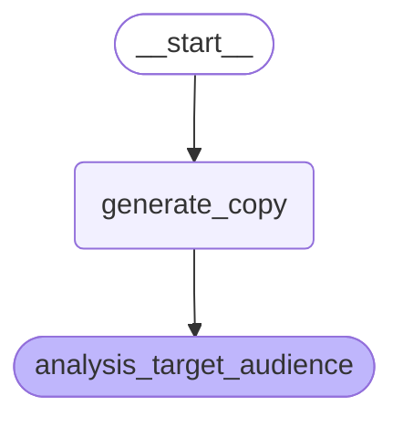
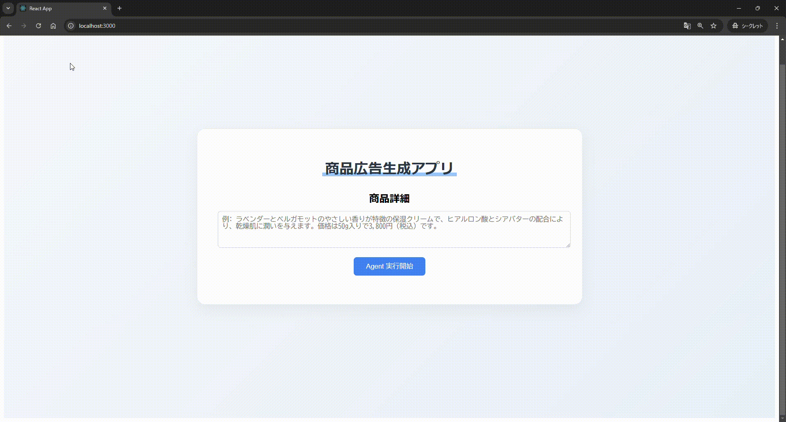

# Streaming Workflow Agent with LangGraph and React using Lambda Web Adapter

LangGraph，React，AWS Lambda Web Adapter を組み合わせて，ワークフロー型 AI エージェントのレスポンスをサーバーレスでストリーミング出力します．



Agent として，以下のような workflow 型の Agent を LangGraph で実装しています．



## 特徴

React アプリ上で，LangGraph で実装した Agent のストリーミングレスポンスをリアルタイムで表示します．バックエンドは Lambda を利用しており，サーバーレスで実装しています．



### バックエンド

- Lambda Web Adapter (LWA) で FastAPI を Lambda 上で実行
- Lambda Function URL でエンドポイントを公開
- LangGraph の `stream` メソッドでレスポンスストリーミングを実現
- AWS CDK で Lambda with Lambda Web Adapter を IaC 化

### フロントエンド

- React による SPA を実装
- CloudFront + S3 でホスティング
- `fetch` API でストリーミングレスポンスを取得
- AWS CDK で CloudFront + S3 を IaC 化

### デモアプリケーション

- 商品情報を入力
- LangGraph エージェントが以下を順次実行:
  - 商品の広告文を生成
  - ターゲット顧客層を分析
- 結果をリアルタイムにストリーミング表示

## デプロイ

### 前提条件

- Node.js (v18 以上)
- Python (v3.12 以上)
- AWS CLI
- AWS CDK
- Docker

### 手順

1. リポジトリのクローン

```bash
git clone https://github.com/yourusername/langgraph-streaming-react-lambda-web-adapter.git
cd langgraph-streaming-react-lambda-web-adapter
```

2. バックエンドのデプロイ

```bash
cd backend
npm ci
cdk deploy
```

3. フロントエンドのデプロイ

```bash
cd frontend/react
npm ci
# `config/api.js` の変数 `LAMBDA_URL` に Lambda Function URL を設定
npm run build
cdk deploy
```

## ローカル開発

### バックエンド

```bash
cd backend/app
docker build -t <image_name> .
docker run --rm -it -p 8080:8080 -v /home/<username>/.aws/:/root/.aws <image_name>

# http://localhost:8080/docsにアクセス可能なことを確認
# 別のターミナルから以下のコマンドでリクエストを送信
curl -X 'POST' \
  'http://localhost:8080/api/stream_graph' \
  -H 'accept: application/json' \
  -H 'Content-Type: application/json' \
  -d '{
  "product_detail": "香りの良い化粧水"
}'
```

### フロントエンド

```bash
cd frontend/react
npm ci
# `config/api.js` の変数 `LAMBDA_URL` に Lambda Function URL を設定
npm start
```
