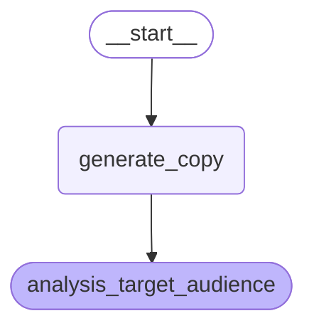

```mermaid
%%{init: {'flowchart': {'curve': 'linear'}}}%%
graph TD;
	__start__([<p>__start__</p>]):::first
	generate_copy(generate_copy)
	analysis_target_audience([analysis_target_audience]):::last
	__start__ --> generate_copy;
	generate_copy --> analysis_target_audience;
	classDef default fill:#f2f0ff,line-height:1.2
	classDef first fill-opacity:0
	classDef last fill:#bfb6fc
```
